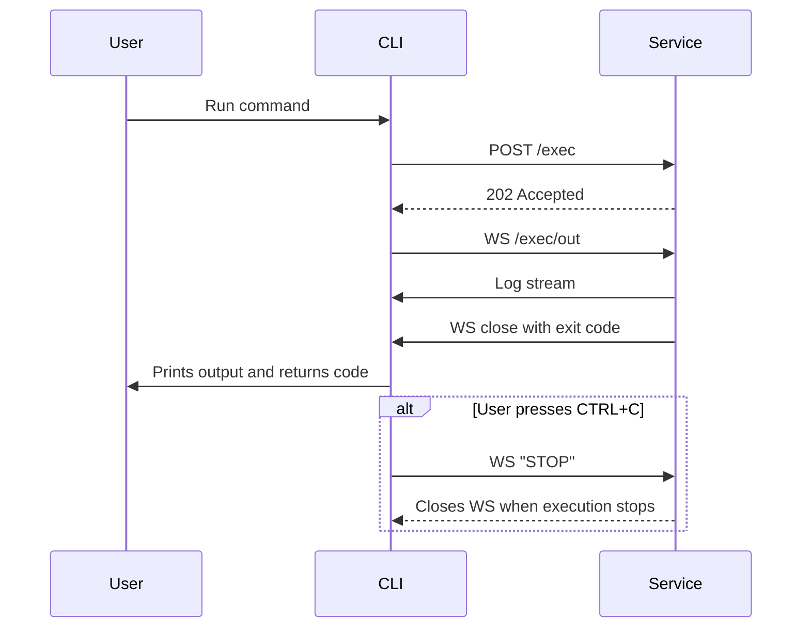

# Wakamiti Runtime

[](https://github.com/wakamiti/wakamiti-runtime/blob/master/README.md)
[](https://github.com/wakamiti/wakamiti-runtime/releases)
[](https://sonarcloud.io/dashboard?id=wakamiti-runtime)
[](https://sonarcloud.io/dashboard?id=wakamiti-runtime)

Wakamiti Runtime is the execution engine for the Wakamiti platform. It is composed of:

- `wakamiti-service`: Java daemon (Helidon MicroProfile) that receives and executes commands.
- `wakamiti-cli`: Go CLI (`waka`) that acts as a proxy to the daemon.
- `wakamiti-dist`: final cross-platform package (scripts + binaries + bundled Java runtime).

Communication is asynchronous: the CLI sends `POST /exec` and streams output from WebSocket `/exec/out`.

## Architecture



## Requirements

- Java 25 (service development/runtime).
- Maven Wrapper included (`mvnw` / `mvnw.cmd`).
- You do not need a preinstalled Go SDK for standard builds: `wakamiti-cli` manages Go 1.25.6 through a Maven plugin.

## Repository layout

- `wakamiti-service`: REST + WebSocket service.
- `wakamiti-cli`: `waka` command.
- `wakamiti-dist`: distribution assembly (`.zip` on Windows, `.tar.gz` on Linux/macOS).

## Quick start (local)

1. Build everything:

```bash
./mvnw clean verify
```

On Windows:

```bat
mvnw.cmd clean verify
```

2. Final package is generated under `target/` (for example `target/wakamiti-windows-x86_64.zip`).

3. Unpack and start the daemon:

- Windows: `bin/wakamitid.bat`
- Linux/macOS: `bin/wakamitid`

4. Run CLI commands:

- Windows: `bin/waka.exe help`
- Linux/macOS: `bin/waka help`

Note: `waka` always forwards commands to the daemon. If the daemon is not running, you will get HTTP timeout errors.

## Configuration

### Service (`wakamiti-service`)

Base config is in `wakamiti-service/src/main/resources/application.yml`:

- Default host: `127.0.0.1`
- Default port: `7264`
- REST endpoint: `POST /exec`
- WS endpoint: `/exec/out`
- Health: `/health`
- OpenAPI UI: `/ui` (spec at `/swagger`)

Supported environment overrides:

- `WAKAMITI_HOST` -> `server.host`
- `WAKAMITI_PORT` -> `server.port`

### CLI (`waka`)

CLI properties are loaded from:

1. `wakamiti.properties` in current working directory.
2. If missing, `wakamiti.properties` next to the executable.
3. If `effective.properties` is defined, that file is merged on top.

Required keys:

- `server.host`
- `server.port`
- `server.auth.origin`

If the expected `Origin` header is missing, `/exec` returns `401`.

## Module-level development

Build/test a single module:

```bash
./mvnw -pl wakamiti-service test
./mvnw -pl wakamiti-cli test
./mvnw -pl wakamiti-dist verify
```

`wakamiti-dist` starts the daemon and runs CLI smoke tests (`version`, `help`) using scripts in `wakamiti-dist/src/test`.

## Common issues

- `Error starting execution: request failed ... timeout`
  Daemon is not reachable at `server.host:server.port`.
- `invalid configuration: server.port must be a valid TCP port`
  Check `wakamiti.properties`/`effective.properties`.
- `401 Unauthorized` on `/exec`
  Check `server.auth.origin` and the `Origin` header sent by the CLI.

## License

This project is licensed under **Mozilla Public License 2.0**. See `LICENSE`.
