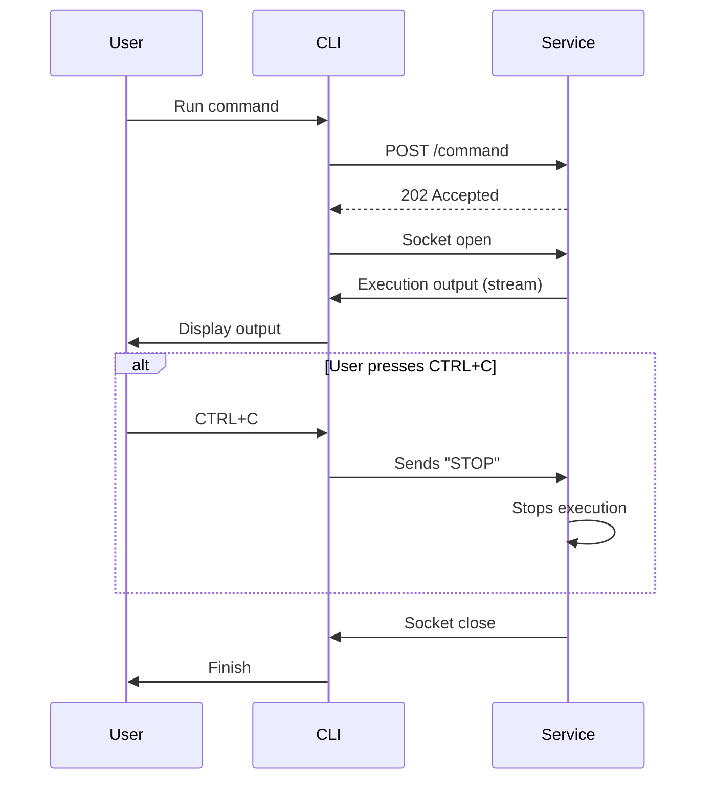

# wakamiti-services

Wakamiti Runtime is the execution engine for the Wakamiti testing platform. It consists of a background service
developed with Helidon MicroProfile and a command-line interface (CLI) built in Go. 
The CLI allows for launching test plans, managing plugins, and executing custom commands, communicating asynchronously
with the main service to orchestrate these tasks.

## Architecture

