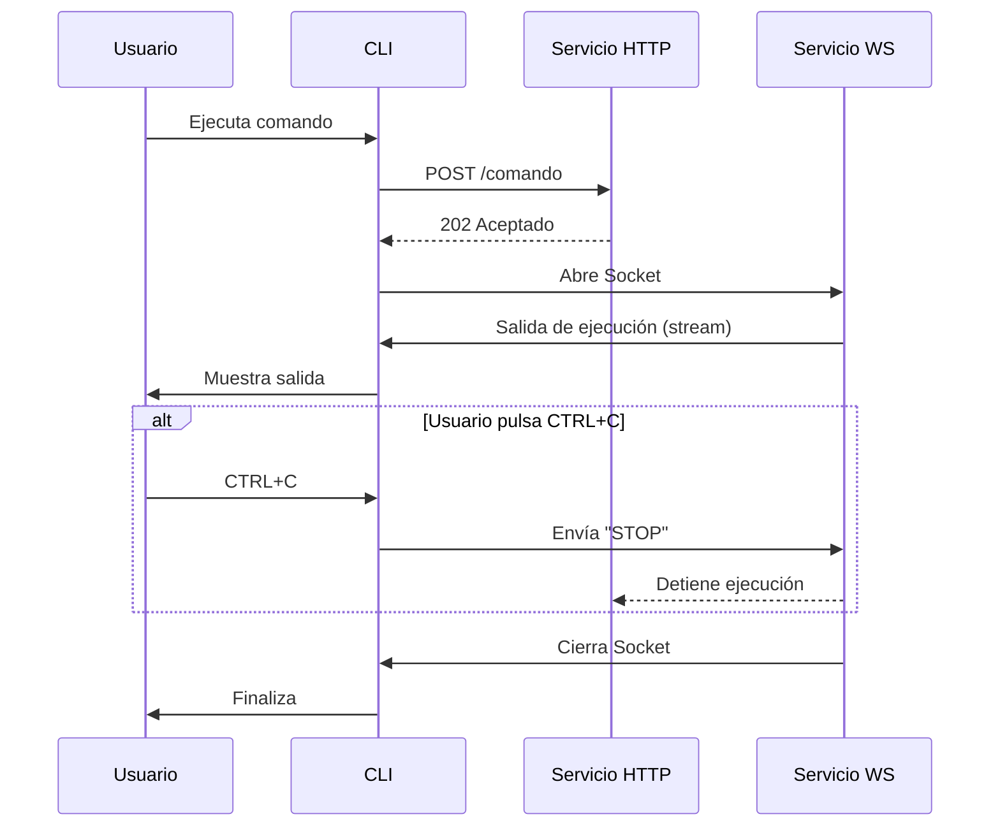

# wakamiti-services

POM padre de Wakamiti Runtime, gestiona los módulos de servicio y CLI.

## Construcción y ejecución

### Construir JRI

Necesitas crear la JRI al iniciar el proyecto para poder usarla en las pruebas durante el desarrollo.
Para hacer esto, ejecuta:
```shell
mvnw -Pjlink initialize
```

También necesitarás configurar el IDE para usar esta JRI al ejecutar las pruebas.

## Arquitectura


