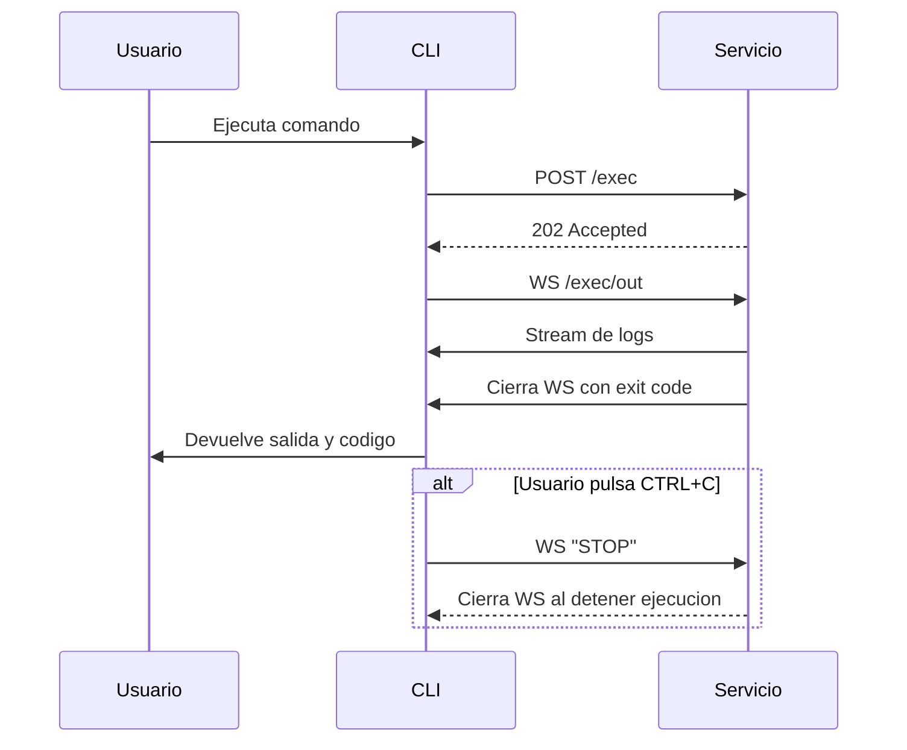

# Wakamiti Runtime

[](https://github.com/wakamiti/wakamiti-runtime/blob/master/README-en.md)
[](https://github.com/wakamiti/wakamiti-runtime/releases)
[](https://sonarcloud.io/dashboard?id=wakamiti-runtime)
[](https://sonarcloud.io/dashboard?id=wakamiti-runtime)

Wakamiti Runtime es el motor de ejecucion de la plataforma Wakamiti. Esta compuesto por:

- `wakamiti-service`: daemon en Java (Helidon MicroProfile) que recibe y ejecuta comandos.
- `wakamiti-cli`: CLI en Go (`waka`) que actua como proxy hacia el daemon.
- `wakamiti-dist`: empaquetado final multiplataforma (scripts + binarios + runtime Java embebido).

La comunicacion es asincrona: el CLI envia un `POST /exec` y consume la salida por WebSocket en `/exec/out`.

## Arquitectura



## Requisitos

- Java 25 (para desarrollo del servicio).
- Maven Wrapper incluido (`mvnw` / `mvnw.cmd`).
- No necesitas instalar Go manualmente para build normal: `wakamiti-cli` descarga/usa SDK Go 1.25.6 via plugin Maven.

## Estructura del repositorio

- `wakamiti-service`: API REST + WebSocket.
- `wakamiti-cli`: comando `waka`.
- `wakamiti-dist`: ensamblado de distribucion (`.zip` en Windows, `.tar.gz` en Linux/macOS).

## Inicio rapido (local)

1. Compilar todo:

```shell
./mvnw clean verify
```

En Windows:

```shell
mvnw.cmd clean verify
```

2. El empaquetado final queda en `target/` (por ejemplo `target/wakamiti-windows-x86_64.zip`).

3. Descomprimir y arrancar daemon:

- Windows: `bin/wakamitid.bat`
- Linux/macOS: `bin/wakamitid`

4. Ejecutar CLI:

- Windows: `bin/waka.exe help`
- Linux/macOS: `bin/waka help`

Nota: `waka` siempre envia el comando al daemon. Si el daemon no esta levantado, veras timeout de conexion HTTP.

## Configuracion

### Servicio (`wakamiti-service`)

Configuracion base en `wakamiti-service/src/main/resources/application.yml`:

- Host por defecto: `127.0.0.1`
- Puerto por defecto: `7264`
- Endpoint REST: `POST /exec`
- Endpoint WS: `/exec/out`
- Health: `/health`
- OpenAPI UI: `/ui` (spec en `/swagger`)

Variables de entorno soportadas:

- `WAKAMITI_HOST` -> `server.host`
- `WAKAMITI_PORT` -> `server.port`

### CLI (`waka`)

El CLI carga propiedades desde:

1. `wakamiti.properties` en el directorio actual.
2. Si no existe, `wakamiti.properties` junto al ejecutable.
3. Si `effective.properties` esta definido, mezcla ese archivo encima.

Claves obligatorias:

- `server.host`
- `server.port`
- `server.auth.origin`

Si falta el header `Origin` esperado por el servicio, la llamada a `/exec` devuelve `401`.

## Desarrollo por modulos

Build y test de un modulo concreto:

```bash
./mvnw -pl wakamiti-service test
./mvnw -pl wakamiti-cli test
./mvnw -pl wakamiti-dist verify
```

El modulo `wakamiti-dist` levanta el daemon y ejecuta pruebas de humo de CLI (`version`, `help`) con scripts en `wakamiti-dist/src/test`.

## Problemas frecuentes

- `Error starting execution: request failed ... timeout`
  El daemon no esta accesible en `server.host:server.port`.
- `invalid configuration: server.port must be a valid TCP port`
  Revisar `wakamiti.properties`/`effective.properties`.
- `401 Unauthorized` en `/exec`
  Revisar `server.auth.origin` y el header `Origin` que manda el CLI.

## Licencia

Este proyecto usa **Mozilla Public License 2.0**. Ver `LICENSE`.
