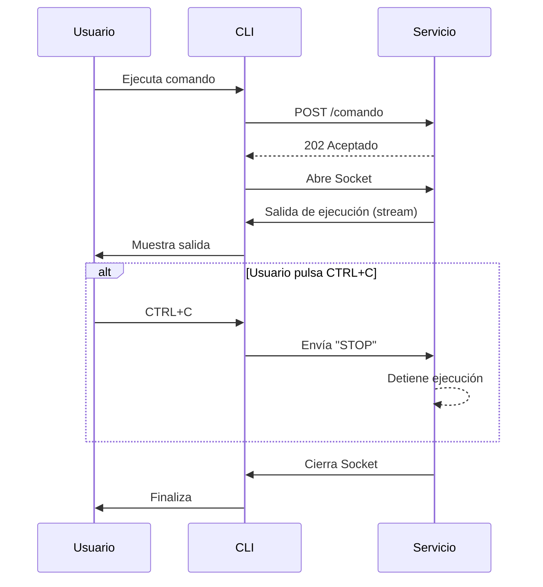

# wakamiti-services

Wakamiti Runtime es el motor de ejecución para la plataforma de pruebas Wakamiti. Se compone de un servicio en 
background desarrollado con Helidon MicroProfile y una interfaz de línea de comandos (CLI) construida en Go. 
El CLI permite lanzar planes de prueba, gestionar plugins y ejecutar comandos personalizados, comunicándose de forma
asíncrona con el servicio principal para orquestar las tareas.

## Arquitectura

