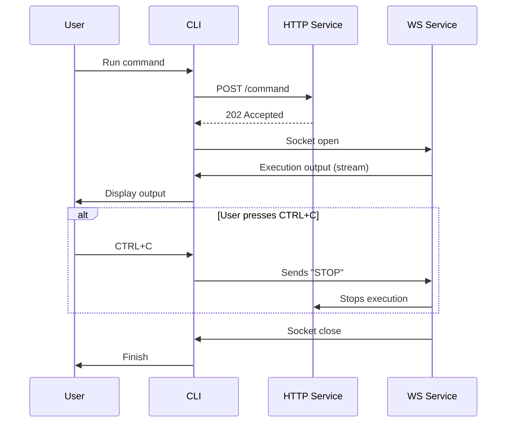

# wakamiti-services

Wakamiti Runtime is the execution engine for the Wakamiti testing platform. It consists of a background service
developed with Helidon MicroProfile and a command-line interface (CLI) built in Go. 
The CLI allows for launching test plans, managing plugins, and executing custom commands, communicating asynchronously
with the main service to orchestrate these tasks.

## Build and run

### Building a Custom Runtime Image

You need to create the JRI when starting the project so that you can use it in tests during development. 
To do this, run: 
```shell
mvnw -Pjlink initialize
```

You will also need to configure the IDE to use this JRI when running tests.

## Architecture


