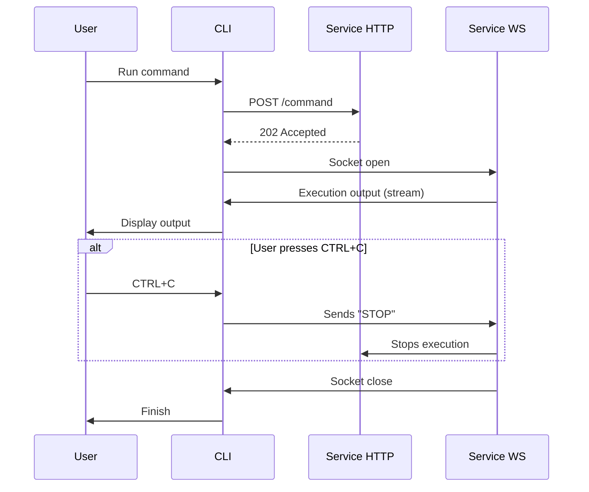

# wakamiti-services

Wakamiti Runtime parent POM, manages service and CLI modules.

## Build and run

### Building a Custom Runtime Image

You need to create the JRI when starting the project so that you can use it in tests during development. 
To do this, run: 
```shell
mvnw -Pjlink initialize
```

You will also need to configure the IDE to use this JRI when running tests.

## Architecture


